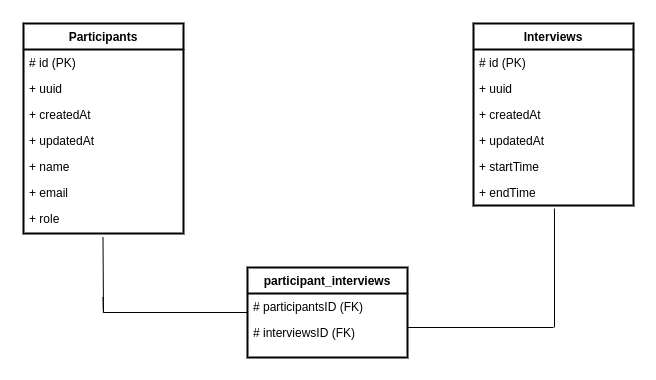
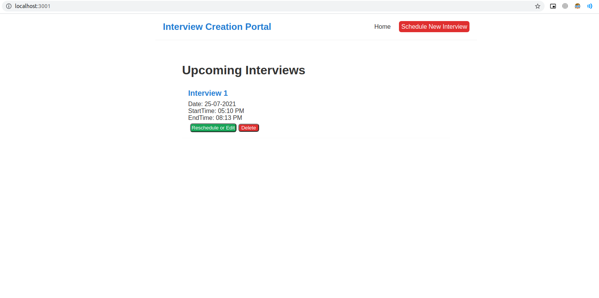
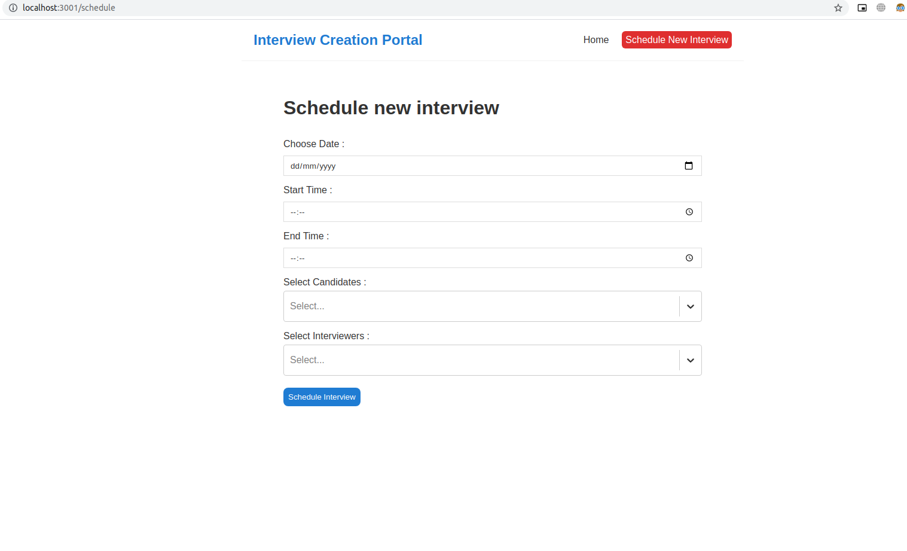

# Interview Creation Portal

Simple app where admins can create/schedule interviews by selecting participants (candidate and interviewers ), start time and end time.

---
**Step 0: Clone this Repository**

## Steps to Setup Backend
1. Move to 'InterviewPortal_Backend' Folder
<br>

2. Execute command `npm install`
3. Install MySQL (if not installed on system ) [Installation](https://dev.mysql.com/doc/mysql-installation-excerpt/5.7/en/)
4. Setting up the Database :
    1. Login to MySQL using root user
    2. Create Database using `CREATE DATABASE DB_NAME;`
    3. Execute these MySQL queries to finalise setting up DB:
        ```
        CREATE USER 'username'@'localhost' IDENTIFIED WITH mysql_native_password BY 'password';
        GRANT ALL PRIVILEGES ON DB_NAME.* TO 'username'@'localhost';
        FLUSH PRIVILEGES;
        exit
        ```
5. Rename these files:<br>
    - .env.example -> .env <br>
    - ormconfig.json.example --> ormconfig.json

6. In the ormconfig.json file:
    - `username` (username of DB user created or present)
    - `password` (password of the DB user)
    - `database` (DB_NAME)
    - By deafult the port for DB(MySQL) is **3306** make sure MySQL is running on port **3306**
7. In the .env file :
    - NODE_ENV = `dev` or `prod`
    - PORT = `8001` (other ports can also be used)
    - `EMAIL` , `PASSWORD` for email service to send emails
8. Execute `npm start`

---

## Steps to Setup Frontend:
1. Move to 'InterviewPortal_Frontend' Folder
<br>

2. Execute `npm install`
3. Ensure that Backend is listening on PORT (e.g. 8001 present in .env file of Backend )
4. Change the file name **.env.example to .env**
5. Move to config.js (src/config/config.js)
6. SET `export const API_PORT = 8001;` (8001 is the port where Backend is listening, other port can also be used)
7. `npm start`

8. App will run at http://localhost:3001/


NOTE: PORTS can be changed and configured as per requirements

---

## Database:
<br>
<p align="center">
  
</p>
<br>

---

## Running App

<br>
<p align="center">
  
</p>
<br>

<br>
<p align="center">
  
</p>
<br>

---